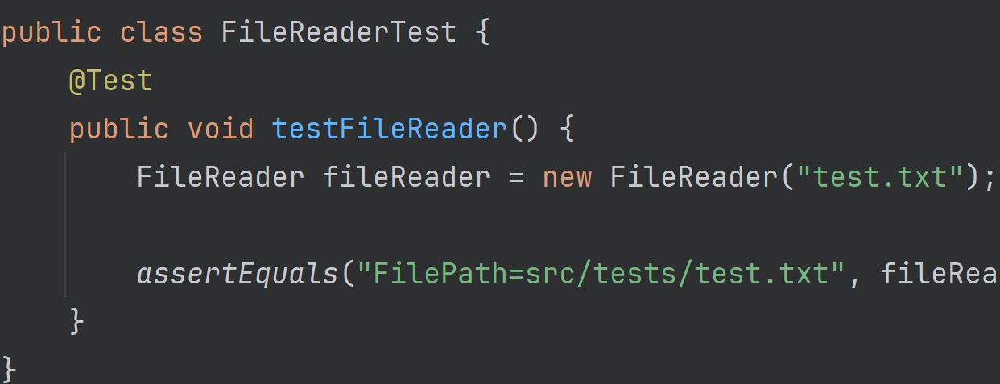

# Individual Programming Assignment: Implementing Iterators

## Overview
In this assignment, you will develop four different iterators in Java that 
demonstrate your understanding of the iterator design pattern. This 
assignment is designed to reinforce concepts in data structures and 
give you practical experience with file operations, string manipulations, 
and mathematical sequences in Java.

### Objectives
- Implement custom iterators for various data structures.
- Gain proficiency with the `Iterable` interface.
- Apply iterator patterns to solve practical problems involving 
  file reading, text processing, and generating sequences.

## Assignment Details

Implement the following classes in Java. Each class should implement the
`Iterable` interface and provide an iterator that allows you to iterate
over the elements of the class in a for-each loop.

### 1. FileReader Class 

Create a `FileReader` class. This class should be capable of being used 
in a for-each loop to read lines from a text file.

#### Requirements:
- The `FileReader` class should accept a file path as a parameter.
- Implement an iterator that returns one line of the file at a time.

#### Starter Code:
You have been provided with some code get you started. The `FileReader` 
class has been created for you, but it is incomplete.

### 2. LineReader Iterator 

Develop a `LineReader` class to iterate over words in a given string.

#### Requirements:
- The `LineReader` class should accept a string as a parameter.
- Implement an iterator that returns each word in the string, 
  assuming words are separated by spaces and contain no punctuation.

#### Starter Code:
You have been provided with some code get you started. The `LineReader`
class has been created for you, but it is incomplete.

### 3. Fibonacci Iterator 

Implement a `Fibonacci` class that generates a sequence of Fibonacci numbers up to a specified `n`.

#### Requirements:
- The `Fibonacci` class should accept a positive integer `n`.
- The iterator should return each Fibonacci number sequentially from the first to the nth number.

#### Starter Code:
You have been provided with some code get you started. The `Fibonacci`
class has been created for you, but it is incomplete.

### 4. DataGrid Iterator 

Create a `DataGrid` class that stores a 2D array of `double` values to iterate over each element row-by-row.

#### Requirements:
- The `DataGrid` class should accept a 2D array of `double` values as a parameter.
- Implement an iterator that returns each number in the grid, moving through each row sequentially.

#### Starter Code:
You have been provided with some code get you started. The `DataGrid`
class has been created for you, but it is incomplete.

### Requirement: Efficient Implementations

Ensure that your iterators are implemented efficiently. For example, the
`Fibonacci` iterator should not recalculate the entire sequence each time
`next()` is called. Instead, it should calculate the next number in the
sequence based on the previous two numbers.

Similarly, the `DataGrid` iterator should not copy the entire grid into a
new data structure. Instead, it should iterate over the existing grid
without creating additional memory overhead.

## Testing
You are required to write comprehensive tests using JUnit 5 
to ensure the correctness of the iterators you implement. Each class should have 
between 3-5 test methods that verify the behavior of the iterators in various 
scenarios.

Here is an example folder structure you might use to organize
your files.

### General Guidelines
- Each test method should focus on a single aspect of the iterator.
- Use assert methods to check that the iterator behaves as expected.
- Provide meaningful test method names that clearly state what aspect of the 
  method is being tested.

### 1. FileReader Tests
Test the `FileReader` class to ensure it correctly reads lines from a file and 
handles errors such as missing files.

#### Example Tests:
- `testReadsAllLines()`: Ensure all lines are read from a non-empty file.
- `testEmptyFile()`: Verify behavior when reading an empty file.
- `testFileNotFound()`: Check the iterator's response to a non-existent file path.

### 2. LineReader Tests
Test the `LineReader` class to ensure it correctly iterates over words in a string.

#### Example Tests:
- `testSingleWord()`: Check iteration over a string containing a single word.
- `testMultipleWords()`: Ensure each word in a multi-word string is returned separately.
- `testEmptyString()`: Test the behavior when iterating over an empty string.

### 3. Fibonacci Tests
Test the `Fibonacci` class to verify it correctly generates Fibonacci numbers 
up to the specified element.

#### Example Tests:
- `testFirstFiveFibonacciNumbers()`: Check the first five Fibonacci numbers.
- `testLargeFibonacciNumber()`: Verify the correct calculation of a higher order 
  Fibonacci number.
- `testFibonacciWithNOne()`: Test Fibonacci sequence generation with n=1.

### 4. DataGrid Tests
Test the `DataGrid` class to ensure it correctly iterates through a 2D array of 
doubles row-by-row.

#### Example Tests:
- `testSingleRowGrid()`: Verify correct iteration over a grid with a single row.
- `testMultipleRowsGrid()`: Test iteration over multiple rows.
- `testEmptyGrid()`: Check behavior when the grid is empty.

## Submitting your work

1. Verify that your tests are passing successfully.
2. Verify that your assignment is passing a linter check using the IntelliJ
   inspector tool.
3. Lastly, ensure your code is correctly pushed to your GitHub classroom repository.